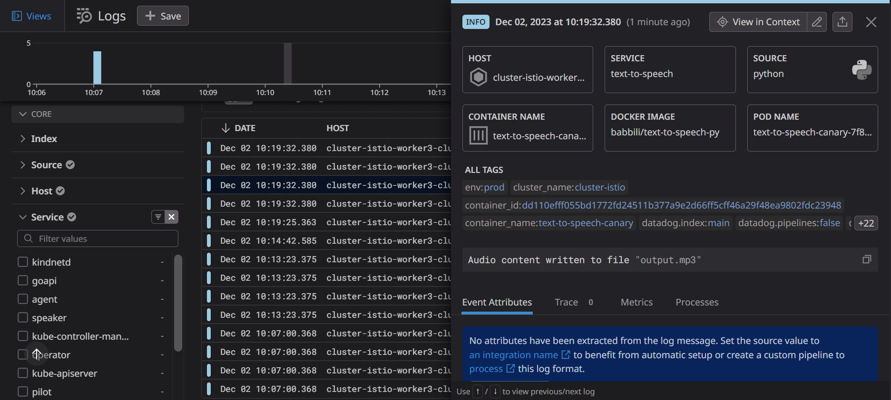

# Kuberentes applications with Istio Service mesh, MetalLB load balancer, and Datadog monitoring

This repository showcases Kubernetes microservices application with Istio service mesh enhancing Istio traffic management and security, MetalLB load balancing and Datadog monitoring & observability covering Kubernetes infrastructure monitoring, application performance monitoring, metrics, distributed traces, code profilers, and logs management


## Install Istio

Install Istio with `minimal profile`, [configuration profiles](https://istio.io/latest/docs/setup/additional-setup/config-profiles/) to apply a customized Istio Ingress Gateway which i included in `kubernetes-manifests/istio-manifests.yaml` file

```bash
istioctl install --set profile=minimal -y
# output
✔ Istio core installed
✔ Istiod installed
✔ Installation complete
```
Create namespace for our application `apps` and add a namespace label to instruct Istio to automatically inject `Envoy sidecar proxies` into its pods, 

these Envoy Proxy sidecars will intercept service-to-service communication and provide traffic management, such as routing rules, load balancing, retries, circuit breakers, timeouts, failovers, ... additionally traffic will be secured with `mTLS` encryption

```bash
kubectl create namespace apps
kubectl label namespace apps istio-injection=enabled

# or add label `sidecare.istio.io/inject: "true"` in the pod template
```

## Deploy Application

the application is a GO API service, text-to-speech service and a client, 

the Go API uses Echo framework to perform CRUD operation, additionally it has `/healthz` route performing Kubernetes health probes, to check the service replicas' readiness and liveness.

the text-to-speech service will communicate with Go api covering its response into audio file, i also configured its Kubernetes manifests to have a `presistent-volume` attached,
the text-to-speech service has two versions, `v1` i made with Go and `v2` as a canary version with Python, i applied **istio canary deployments** to send **70%** of the requests to the Golang version `v1` and **30%** of requests to the canary version `v2` python, and i'll be observing the two versions' performance later with Datadog APM.


```bash
# apply the application's manifests 

kubectl apply -f kubernetes-manifests/go-api.yaml
kubectl apply -f kubernetes-manifests/client.yaml
kubectl apply -f cluster/secret.yaml
kubectl apply -f kubernetes-manifests/persistent-volume.yaml
kubectl apply -f kubernetes-manifests/text-to-speech.yaml
kubectl apply -f kubernetes-manifests/text-to-speech-canary.yaml

```
```bash
kubectl -n apps get all
# we can see in the output that each pod has 2 containers, one is the application's container and the other is th envoy proxy sidecar container which got injected by Istio
# output
NAME                                         READY   STATUS    RESTARTS      AGE
pod/alpine-78d69bd9d-6d7g9                   2/2     Running   0             8m48s
pod/goapi-7769bd9d6f-75tbs                   2/2     Running   0             8m49s
pod/goapi-7769bd9d6f-vkrpk                   2/2     Running   0             8m49s
pod/goapi-7769bd9d6f-zwqsb                   2/2     Running   0             8m49s
pod/text-to-speech-6d886cc4fc-mql6x          2/2     Running   1 (48s ago)   58s
pod/text-to-speech-canary-7f89f6ffb5-pbq27   2/2     Running   0             52s

NAME                     TYPE        CLUSTER-IP      EXTERNAL-IP   PORT(S)    AGE
service/alpine           ClusterIP   10.96.40.164    <none>        5000/TCP   8m49s
service/goapi            ClusterIP   10.98.217.225   <none>        80/TCP     8m49s
service/text-to-speech   ClusterIP   10.99.196.128   <none>        80/TCP     58s

NAME                                    READY   UP-TO-DATE   AVAILABLE   AGE
deployment.apps/alpine                  1/1     1            1           8m49s
deployment.apps/goapi                   3/3     3            3           8m49s
deployment.apps/text-to-speech          1/1     1            1           58s
deployment.apps/text-to-speech-canary   1/1     1            1           52s

NAME                                               DESIRED   CURRENT   READY   AGE
replicaset.apps/alpine-78d69bd9d                   1         1         1       8m49s
replicaset.apps/goapi-7769bd9d6f                   3         3         3       8m49s
replicaset.apps/text-to-speech-6d886cc4fc          1         1         1       58s
replicaset.apps/text-to-speech-canary-7f89f6ffb5   1         1         1       52s
```


## Apply Istio Ingress Gateway and Istio traffic management resources

apply a custom `istio-ingressgateway` and traffic managemt resources such as virtual services, destignation rules which i included in `kubernests-manifests/istio-manifests.yaml` file

```bash
# first i'll untaint the control plane node as i configured it to have port-mapping and `istio-ingressgateway` pods with node affinity to get scheduled on it
kubectl taint nodes --all node-role.kubernetes.io/control-plane-
# output
node/cluster-istio-control-plane untainted

# apply istio-manifests.yaml file
kubectl apply -f kubernetes-manifests/istio-manifests.yaml
# output
service/istio-ingressgateway created
deployment.apps/istio-ingressgateway created
role.rbac.authorization.k8s.io/istio-ingressgateway-sds created
rolebinding.rbac.authorization.k8s.io/istio-ingressgateway-sds created
gateway.networking.istio.io/gateway created
virtualservice.networking.istio.io/goapi-vs created
virtualservice.networking.istio.io/alpine-vs created
virtualservice.networking.istio.io/text-to-speech-vs created
destinationrule.networking.istio.io/text-to-speech-destination-rule created
```

```bash
# check the resources created in `istio-system` namespace
kubectl -n istio-system get all
# output
NAME                                        READY   STATUS    RESTARTS   AGE
pod/istio-ingressgateway-6c8ffd96dc-gq45b   1/1     Running   0          71s
pod/istiod-7f69bdfd9-zt2fd                  1/1     Running   0          24m

NAME                           TYPE           CLUSTER-IP      EXTERNAL-IP   PORT(S)           
                      AGE
service/istio-ingressgateway   LoadBalancer   10.104.228.63   <pending>     80:31458/TCP,443:31299/TCP              71s
service/istiod                 ClusterIP      10.105.90.96    <none>        15010/TCP,15012/TCP,443/TCP,15014/TCP   24m

NAME                                   READY   UP-TO-DATE   AVAILABLE   AGE
deployment.apps/istio-ingressgateway   1/1     1            1           71s
deployment.apps/istiod                 1/1     1            1           24m

NAME                                              DESIRED   CURRENT   READY   AGE
replicaset.apps/istio-ingressgateway-6c8ffd96dc   1         1         1       71s
replicaset.apps/istiod-7f69bdfd9                  1         1         1       24m

NAME                                         REFERENCE           TARGETS         MINPODS   MAXPODS   REPLICAS   AGE
horizontalpodautoscaler.autoscaling/istiod   Deployment/istiod   <unknown>/80%   1         5         1          24m
```
we can see that the EXTERNAL-IP for `service/istio-ingressgateway` type`LoadBalancer` is pending, for that we need to install `MetalLB` which is a load balancer used for on-prem Kubernetes, MetalLB will allocate an external IP address for Istio Ingress Gateway

we also applied in same `kubernetes-manifests/istio-manifests.yaml` file Istio **virtual services** for each service in the `apps` namespace, and an **Istio Gateway** which is assigned to `goapi` service

```bash
# check istio virtual services created in `apps` namespace 
kubectl -n apps get virtualService
# output
NAME                GATEWAYS                   HOSTS                                       AGE
alpine-vs                                      ["alpine.apps.svc.cluster.local"]           74s
goapi-vs            ["istio-system/gateway"]   ["goapi.apps.svc.cluster.local"]            74s
text-to-speech-vs                              ["text-to-speech.apps.svc.cluster.local"]   74s

# check Kubernetes resouce kind: Gateway created in `istio-system` namespace
kubectl -n istio-system get gateway
#output
NAME      AGE
gateway   82s
```

apply **Istio Peer Authentication** resource which will force `mTLS` traffic for all workloads in the application namespace

```bash
kubectl apply -f kubernetes-manifests/istio-peer-authentication.yaml
```


## Install MetalLB

MetalLB is a load-balancer implementation for bare metal/on-prem Kubernetes clusters

Preparation : If your cluster is using `kube-proxy` in IPVS mode, you have to enable strict ARP mode
You can achieve this by editing kube-proxy config in the cluster
```bash
kubectl get configmap kube-proxy -n kube-system -o yaml | \
sed -e "s/strictARP: false/strictARP: true/" | \
kubectl apply -f - -n kube-system
# output
configmap/kube-proxy configured
```

To install MetalLB, apply the manifest
```bash
kubectl apply -f https://raw.githubusercontent.com/metallb/metallb/v0.13.12/config/manifests/metallb-native.yaml

```
wait untill  `metallb-system/speaker` daemonsets are running, then apply MetalLB `IPAddressPool` and `L2Advertisement` which i configured the load balancer ip-address to be advertised in
```bash
kubectl apply -f kubernetes-manifests/metallb-config.yaml

# output
ipaddresspool.metallb.io/ip-pool created
l2advertisement.metallb.io/metallb-ip-adv created
```
if we check `istio-ingressgateway` LoadBalancer service now, it has an external ip assigned, `172.18.0.10`, which we can use now to call `goapi` service

```bash
kubectl -n istio-system get svc/istio-ingressgateway -owide

# output
NAME                   TYPE           CLUSTER-IP      EXTERNAL-IP   PORT(S)                   
   AGE   SELECTOR
istio-ingressgateway   LoadBalancer   10.104.228.63   172.18.0.10   80:31458/TCP,443:31299/TCP   18m   istio=ingressgateway
``` 
```bash
export GATEWAY_IP=$(kubectl -n istio-system get svc istio-ingressgateway -o jsonpath="{.status.loadBalancer.ingress[0].ip}")
echo $GATEWAY_IP
# output
172.18.0.10
```


i'll exec into the client pod to create intries for the Go books API using `curl`

```bash
kubectl -n apps exec -it pod/alpine-78d69bd9d-6d7g9 -- sh

/app $ curl -H "Content-Type: application/json" -d '{ "author": "occupytheweb", "title": "Network Basics for Hackers"}' -X POST http://goapi.apps.svc.cluster.local/books
{"id":1,"title":"Network Basics for Hackers","author":"occupytheweb"}

/app $ curl -H "Content-Type: application/json" -d '{ "title": "Build Systems with Go", "author": "Juan Tirado"}' -X POST http://goapi.apps.svc.cluster.local/books
{"id":2,"title":"Build Systems with Go","author":"Juan Tirado"}

/app $ curl -v http://goapi.apps.svc.cluster.local/books
# output
*   Trying 172.18.0.10:80...
* Connected to goapi.apps.svc.cluster.local (172.18.0.10) port 80
> GET /books HTTP/1.1
> Host: goapi.apps.svc.cluster.local
> User-Agent: curl/8.4.0
> Accept: */*
>
< HTTP/1.1 200 OK
< content-type: application/json; charset=UTF-8
< date: Sat, 02 Dec 2023 05:13:28 GMT
< content-length: 73
< x-envoy-upstream-service-time: 2
< server: envoy
<
{"1":{"id":1,"title":"Network Basics for Hackers","author":"occupytheweb"},"2":{"id":2,"title":"Build Systems with Go","author":"Juan Tirado"}}
* Connection #0 to host goapi.apps.svc.cluster.local left intact
```

we also can check **Istio canary deployments** implementation but sending requests to `text-to-speech` service, we an see that `70%` of requests are sent to the Go version v1, and `30%` of requests are sent to the Python canary verion v2

```bash
kubectl -n apps exec -it pod/alpine-78d69bd9d-6d7g9 -- sh

# `70%` of requests are sent to the Go version v1, and `30%` of requests are sent to the Python canary verion v2
/app $ curl http://text-to-speech.apps.svc.cluster.local/
text-to-peech Go!
/app $ curl http://text-to-speech.apps.svc.cluster.local/
TTS canary version (Python)!
/app $ curl http://text-to-speech.apps.svc.cluster.local/
TTS canary version (Python)!
/app $ curl http://text-to-speech.apps.svc.cluster.local/
text-to-peech Go!
/app $ curl http://text-to-speech.apps.svc.cluster.local/
text-to-peech Go!
/app $ curl http://text-to-speech.apps.svc.cluster.local/
text-to-peech Go!
/app $ curl http://text-to-speech.apps.svc.cluster.local/
text-to-peech Go!
/app $ curl http://text-to-speech.apps.svc.cluster.local/
text-to-peech Go!
/app $ curl http://text-to-speech.apps.svc.cluster.local/
text-to-peech Go!
/app $ curl http://text-to-speech.apps.svc.cluster.local/
TTS canary version (Python)!
```


# Monitoring & Observability with Datadog

install Datadog with `datdog-operator` Helm charts

```bash
kubectl create ns datadog
helm repo add datadog https://helm.datadoghq.com
helm install -n datadog datadog-operator-rel0 datadog/datadog-operator
# output

NAME: datadog-operator-rel0
LAST DEPLOYED: Sat Dec  2 09:04:47 2023
NAMESPACE: datadog
STATUS: deployed
REVISION: 1
TEST SUITE: None
NOTES:
```


apply `datadog-agent.yaml` file which will collect Traces, Metrics and Logs from the out cluster, the file includes Log Mangement, Network Performance Monitoring (NPM), Cluster Agent, Cluster checks runners, Events & Processes collection enabled, and Application Performance Monitoring (APM) with **hostPort** configured to allow Istio sidecars to connect with the agent

```bash
kubectl -n datadog apply -f datadog/datadog-agent.yaml
# output
datadogagent.datadoghq.com/datadog created

# apply datadog secret
kubectl -n datadog apply -f cluster/dd-secret.yaml
# output
secret/datadog-secret created
```

### istio configuration for Datadog

upgrade Istio installation by applying `kubernetes-manifests/istio-operator.yaml` that i configued to have Datadog as proxy tracer
```bash
kubectl -n istio-system apply -f kubernetes-manifests/istio-operator.yaml
# output
istiooperator.install.istio.io/installed-state configured
```


## Datadog Infrastructure Monitoring

Datadog Infrastructure Monitoring monitors & Tracks your hosts metrics, containers, processes

below is Infrastructure List, show Kubernetes nodes status, CPU usage for each node, IOwait ,... 


containers map grouped by `short_image`, the red containers indecate high consumption on the metric selected while the green shows a low consumption and a good state


total CPU% and RSS memory timeline for each container


list of all containers in the cluster with state and metrics of each


Kubernetes pods with their status, we can tell easily if any pod's state is crashing, pending, container creating or Running. cpu and memory usage limits, ips, ...


Kuberentes lusters, namespaces, nodes, deployments and other resources


Kuberenetes persistent volumes, and persistent volume claims that was created for the text-to-speech service, shows status `bound` 


## Application Performance Monitoring (APM)

APM can gives us visibility into Traces, code Profiles ,Service Catalog and Service List

below is the `Service List` shows req/s P99 latency and error rate per services


the grpc client is the python client calling Google Cloud texttospeech api and performing tts function


**APM `Traces`**


here we can see the time spans for each trace


**APM code `Profilers`** 

Profilers go deep inside the code to show us metrics such as CPU time for each function in our code
below is the profiler for the python text-to-speech service


## Logs Management

Logs Management collects and visualize in one place all our applications containers' logs, network logs, firewall logs, system and infrastructure logs 


we can filter and group logs according to `service`, `env`, `status`, `@http.status_code`, `@http.url`, `@Method` , ...





